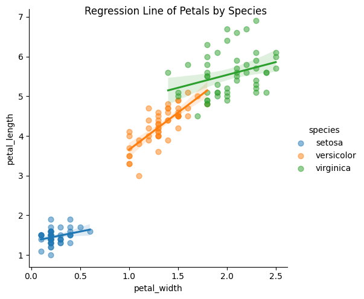

# Correlation Analysis of Iris Flower Measurements

## A look into the Iris Flower Dataset

 

Statistical Analysis AI & ML - 2024  
&nbsp; - By Alexander Wessner

 

This report examines the correlation in Iris flower measurements, particularly the connection between petal width/length and sepal width/length. Furthermore it aims to evaluate whether a linear regression model is appropriate for accurately representing these relationships.

 

### Table of Contents

[Explaining Iris Data](#explaining-iris-data)  
[Hypothesis](#hypothesis)  
[Methodology](#methodology)  
[Analysis](#analysis)  
[Petal](#petal)  
[Sepal](#sepal)  
[Correlation](#correlation)  
[Correlation Test](#correlation-analysis-of-iris-flower-measurements)  
[Hypothesis evaluation](#hypothesis-evaluation)  
[Sample Data and Predicted Values](#sample-data-and-predicted-values)  
[Conclusion](#conclusion)  

 

# Explaining Iris Data

The data used comes from the [Iris Flower Dataset](https://www.kaggle.com/datasets/arshid/iris-flower-dataset) at Kaggle.

The dataset holds measurements of 150 Iris flowers evenly destributed among 3 subspecies (50 each), *Iris Setosa*, *Iris Versicolor* and *Iris Virginica*. 

This image shows the different subspecies:

Every measurement includes the following:
- Petal Width
- Petal Length
- Sepal Width
- Sepal Length

 

# Hypothesis

### Petal Hypothesis

Petal length and width exhibit a notable correlation.

$H_0: \rho = 0$  
$H_A: \rho \neq 0$  
$\alpha = 0.05$

### Sepal Hypothesis

Sepal length and width exhibit a notable correlation.

$H_0: \rho = 0$  
$H_A: \rho \neq 0$  
$\alpha = 0.05$

[Back To Top](#table-of-contents)

# Methodology

### Methodology moving forward with the analysis:

- Examine the scatterplot distribution of petal and sepal values to obtain a preliminary assessment of potential linear relationships. Understanding the point distribution is crucial for accurate analysis in subsequent stages.
- Calculate the bivariate correlation, *Pearson's R*, between the width and length of both petals and sepals.
- Assess the significance of the correlation by testing hypotheses based on the obtained r- and p-values. Strong correlation is indicated by a high r and a low p-value, with significance determined by comparing the p-value to the predetermined level in the hypotheses.
- If a significant correlation is identified, employ a linear regression model for point prediction.

 

# Analysis

## Petal

Upon initial examination of the petal point distribution, it looks like the relationship between petal width and length is linear. Though there is a gap with no measurements, the overall trend does seem linear in nature.

 

## Sepal

Transitioning to the sepal point distribution, there is an absence of apparent  correlation among the values. Although a regression plot displays a regression line, the widely scattered points indicate a lack of a discernible linear relationship between them.

Alternatively, examining sepal data categorized by species may offer a more insightful explanation for the relationship between points. This plot seems to provide a clearer dpiction of the connection between width and height. Specifically, in the case of Iris Setosa, there appears to be some observable correlation

  

# Correlation

Examining a correlation heatmap of the entire dataset, including various species, reinforces earlier observations:

- For sepals, the correlation between width and length across the entire dataset is nearly zero. Even when dividing the dataset by subspecies, this relationship remains consistent, except for Versicolor, which exhibits some correlation. 
- In the case of petals, a correlation between width and length, as noted earlier, is evident. However, dividing the dataset by species reveals a notably weaker correlation between petal measurements. 

The plot illustrates r-squared values to indicate the strength of correlation exclusively. Unlike an r-value, which ranges from -1 to 1, r-squared spans from 0 to 1. Values closer to 0 signify weaker correlation, while those approaching 1 indicate stronger correlation. Given the report's emphasis on determining the presence of correlation, regardless of its direction, the decision to use r-squared was based on its relevance and clarity in portraying correlation in this context. 

 

Considering the observed weaker correlation, especially when dividing petals by species, a scatter plot with regression lines provides a detailed explanation of this relationship. Versicolor exhibits some correlation, while Setosa and Virginica display considerable scatter, deviating from the regression line. Interestingly, it appears that Setosa petals may have an independent relationship between width and height, as most data points share the same width measurement regardless of length.

  

# Correlation Test

Compute bivariate correlation using "*pearsonr*" from the "*scipy.stats*" module.

 

Correlation between petal width and length:
> r = 0.963, p = 5.776660988495174e-86

A robust positive correlation is indicated by a strong positive r-value, coupled with a p-value < 0.001, affirming a statistically significant and strong correlation between petal width and length.

 

Correlation between sepal width and length:
> r = -0.109, p = 0.18276521527136963

A weak negative r-value, accompanied by a high p-value, indicates no statistically significant correlation between sepal width and length.

  

## Hypothesis Evaluation

### I. Petal Hypothesis

$H_0: \rho = 0$ - Null Hypothesis 
$H_A: \rho \neq 0$ - Alternative Hypothesis  
$\alpha = 0.05$ - Significance Level

&nbsp;&nbsp;&nbsp;&nbsp;&nbsp;&nbsp; $p = 0.0000 \rightarrow p \lt \alpha \rightarrow \text{reject } H_0$ 

The calculated p-value is 0.0000, which is less than the significance level. Therefore, the null hypothesis is rejected.

**Conclusion:** There is sufficient evidence to conclude that there is a significant correlation between petal width and length.

 

### II.

$H_0: \rho = 0$ - Null Hypothesis 
$H_A: \rho \neq 0$ - Alternative Hypothesis 
$\alpha = 0.05$ - Significance Level

&nbsp;&nbsp;&nbsp;&nbsp;&nbsp;&nbsp; $p = 0.1828 \rightarrow p \gt \alpha \rightarrow \text{can not reject } H_0$

The calculated p-value is 0.1828 (rounded), which is greater than the significance level. Therefore, the null hypothesis cannot be rejected.

**Conclusion:** There is insufficient evidence to conclude that there is a significant correlation between sepal width and length.
  
[Back To Top](#table-of-contents)
  

# Sample Data and Predicted Values

Given the significant correlation established for Iris petals, an Ordinary Least Squares (OLS) linear regression model can be employed for prediction. The model is trained using data points from the dataset and is utilized for in-sample prediction. In-sample prediction involves forecasting y-values based on x-values within the dataset's range.

While it is possible to predict values outside the dataset, the model's accuracy diminishes, particularly for points significantly beyond the dataset's span. The reliability of extrapolating trends observed in the data to points outside of it is limited. 

As an illustration, 50 randomly generated x-values (width) for petals, falling within the dataset's minimum and maximum width values, are superimposed on the earlier regression plot for petals. The model successfully predicts y-values (length) for each input x-value, and these predictions align with the regression line, affirming the model's effectiveness within the dataset's range. 

It is important to highlight the data gap between the smaller measurements, Setosa, and the larger ones, Versicolor & Virginica. Notably, there are no data points within this range in the dataset. Given the lack of correlation within individual species, apart from Versicolor, accurate prediction of petals falling within this range might be challenging. However, since measurements in this range appear to be rare, the overall accuracy of the model is likely not significantly affected, though this potential limitation is worth acknowleding.  

[Back To Top](#table-of-contents)

  
# Conclusion

The analysis of the relationship between width and length measurements of petals and sepals has led to the following conclusions:

**For Petal Measurements:**
> There is a significant correlation between petal width and length.

A linear regression model is deemed suitable for predicting petal measurements, given the significant correlation between petal width and length. However, it is crucial to note a data gap that might lead to inaccuracies in predictions for values within that range. Additionally, when dividing the dataset by species, the correlation weakens, which should be considered. 
 

**For Sepal Measurements:**
> A significant correlation could not be proven between sepal width and length.

A linear regression model may not be well-suited for predicting sepal measurements, as a significant correlation between sepal width and length could not be established. Segmenting sepals based on species might yield a stronger correlation, particularly in the case of Iris Setosa. 

[Back To Top](#table-of-contents)